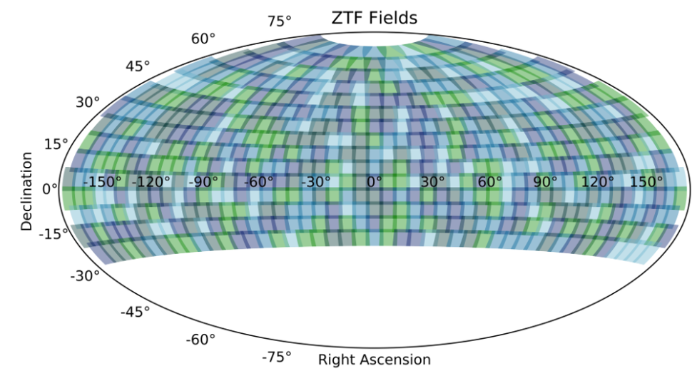
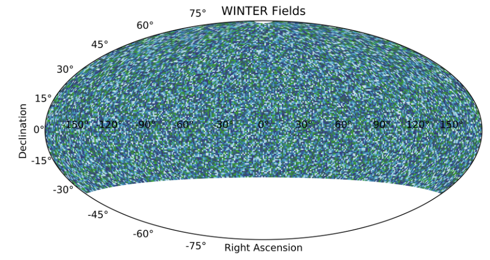
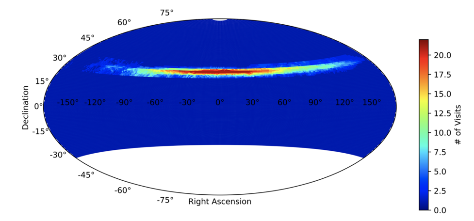
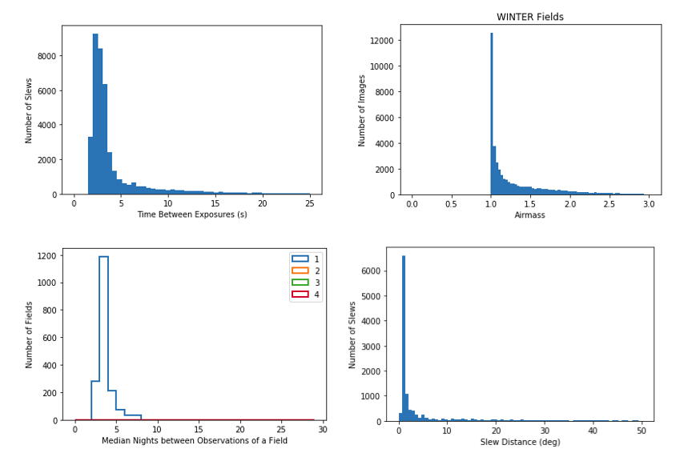

# WINTER Scheduler Documentation
### Danielle Frostig 05/2020 


## Scope 

As part of it’s autonomous observing program, WINTER must generate an observing plan that balances scientific goals of the project while maximizing the scientific quality of the data. The science goals, in order of decreasing priority, are:

1.	Kilonova searches: WINTER will ingest LIGO alerts of neutron star mergers or neutron star black hole mergers. These alerts interrupt all other observations and must be immediately integrated into the nightly schedule. 
2.	Infrared surveys: Surveys of varying cadences and science goals will constitute the majority of observation time.
3.	Guest observations: Up to 25% of observation time is allocated to guest observations, consisting of a variety of observation types, which must be interwoven with the kilonova searches and infrared surveys.

We adapted the Zwicky Transient Facility (ZTF) scheduler for the WINTER project to create a customized WINTER scheduler that builds on the extensive functionality of the ZTF scheduler. Principally, the ZTF scheduler balances many different observing programs with unique cadences while also maximizing data quality by selecting fields through volumetric weighting. In this scheme, the most desirable field probes the greatest volume (Vlim) for any given exposure. The limiting volume for an exposure is related to the distance (dlim) at which a source of absolute magnitude M will be detected. This is constrained by seeing, sky brightness, and instrument noise, which all factor into the limiting magnitude (mlim) for an exposure. Thus, with the distance modulus, dlim=10^0.2(m_lim - M +5) , and Vlim  α dlim^3, each exposure has a volumetric weighting of V=10^0.6(m_lim - 21) (Bellm et al. 2019). 

The ZTF scheduler offers several modes for simulations and on-sky observing. Queue observing ingests a predefined list of fields and steps through each field sequentially, greedy observing continuously selects the best target (based on the volumetric weighting scheme) for a given time--recalculating before each target, and Gurobi observing uses the Gurobi linear optimizer to solve a travelling salesman problem to optimize each night of observing (Bellm et al. 2019). All three modes are used in WINTER’s observing program: queue observing is suited for defined targets of opportunity, such as LIGO alerts, greedy observing works well for reference building surveys which contain too many fields to optimize across, and Gurobi observing is appropriate for balancing science surveys with varying cadences. 
   


## Use 

The WINTER scheduler takes in 4 json (JavaScript Object Notation) configuration files. The top-level reference file (e.g. allsky_config) specifies the name of the run and the default and fallback observing queues. Two more json configuration files specify the observable fields, cadence, filters, and other parameters for default and fallback observing queues (e.g. `allsky_reference_building.json` and `j_band_fallback.json`, respectively). Finally, a timing configuration file (e.g. `2021_config.cfg`) specifies the start date, duration, and weather conditions (for simulated observing only) for the run. The WINTER scheduler can be run in the top-level folder (with the README file) with `run_winter_sim.py` as follows:

``` python
python run_winter_sim.py './sims/allsky_config.json' './config/2021_reference.cfg'
```

## Run Nightly

There is a separate folder called daily_winter_scheduler that runs one nightly sim and pulls from the long term database. The nightly schedules are written to `~/data/schedules/nightly_YYYMMDD.db` and pull from the master database at `~/data/WINTER_ObsLog.db`. To run the nightly mode, go to the daily_winter_scheduler file and run:
``` python
python run_winter_sim.py './sims/allsky_config.json' './config/tonight.cfg'
```
## Major changes from the ZTF Scheduler

The WINTER version of the ZTF scheduler implements the following changes to account for WINTER’s differing project requirements. For general bookkeeping, the major changes to the code and the files affected are listed below each category in gray. 

1.	Removes 1 filter per time slot constraint: ZTF’s filter changing mechanism takes 135 seconds, as opposed to WINTER’s ~8 seconds, to exchange passband filters. Therefore, to minimize overhead time and simplify optimizations ZTF is constrained to one filter per time slot (set to 30 minutes). For WINTER’s implementation, we removed this constraint from the optimization and instead introduced the filter exchange time as an overhead time in the travelling salesman problem. This requires reindexing the scheduler such that each observable field in each filter is a unique request and a filter exchange presents extra overhead time between requests. This solution accomplishes WINTER’s science goals more closely by allowing for frequent filter exchanges but can slow down the scheduler optimization by introducing more requests to optimize over.
    1.	Remove 1 filter constraint in optimize.py by setting number of filters per block to <=3. 
    2.	Reindexed QueueManager.py and small parts of the rest of the scheduler, such as simulate.py
    3.	Added filter exchange time to traveling salesman problem in QueueManager.py 

2.	Replaces ZTF fields with smaller WINTER fields: WINTER has a ~1 square degree field of view, as opposed to ZTF’s 47 square degree field of view and can observe to a higher airmass. Combining these two factors, the WINTER simulator must optimize across ~35,000 fields compared to ~600 fields for ZTF (Figure 1). This volume of pointings makes the ZTF program for the Gurobi optimizer prohibitively slow for WINTER reference building surveys and large all-sky surveys. To run reasonable simulations for WINTER, we rewrote how the Gurobi optimizer mode sorts and searches through request databases. By implementing multilevel indexing of databases, rather than searching each line of a database for a request, a simulation that ran in ~24 hours with the original ZTF code instead runs in 13 minutes.    
    1.	Created WinterFields.txt
    2.	Changed hard coded field limit in Fields.py that constrain the user to 4000 fields. 
    3.	Replaced scalar compare line by line searches in optimize.py with multilevel indexing of databases. 





*Figure 1: A comparison of all possible ZTF pointings (top) and WINTER pointings (bottom). WINTER has a smaller field of view and observes a higher airmass, leading to ~60 times more WINTER fields than ZTF fields.*

3.	Redefines sky brightness models and atmospheric extinction for an infrared sky:
The ZTF project is a follow-up to the Palomar Transient Factory (PTF), which also conducted all-sky surveys on the same telescope in the same visible wavebands (g, r, and i). Variables that go into computing the limiting magnitude and therefore the volumetric weighting of fields--e.g. sky brightness, zeropoints, and atmospheric extinction--are all based on historic PTF data. WINTER observes in infrared wavelengths and has no preceding project in the right wavebands on Palomar mountain (Y, J, and Hs). Instead, we model the IR sky based on the Gemini Observatory in Mauna Kea, Hawaii. Sky brightness is based on Roth et al. 2016, which also concludes that for infrared wavelengths sky brightness changes significantly only within 20 degrees of the moon. In contrast, the visible wavelengths observed by ZTF, moonglow casts a gradient of brightness across the whole sky. For WINTER, we simplify this model by invalidating any fields within 20 degrees of the moon and conduct no further modeling beyond 20 degrees. The scaling of zeropoint by altitude is modeled after Tokunaga et al. 2002 for the J and H filters and after Hillenbrand et al. 2002 for the Y-band. Combining these models with the WINTER project specifications (e.g. throughput, noise levels, aperture, and zeropoints) leads to a complete model for limiting magnitude (Figure 2). Once WINTER is on sky, we will replace these models with data from WINTER observations. 

** Old image that needs to be updated. Not going to bother inserting ** 
Figure 2: Limiting magnitude by waveband for a 90 second exposure on the WINTER telescope.

4.	Other project differences: The remaining project differences between WINTER and ZTF, such as instrument noise values, slew times, pixel scale, readout times, and other similar constants, are contained in variables in constants.py. The one exception is limiting hour angles (e.g. the telescope cannot point at a tree) are hard-coded into QueueManager.py and will be changed for WINTER once the project is on sky. 
    1.	Changed all variables in constants.py
    2.	Removed hour angle constraints in QueueManager.py 


## Known issues:

Twilight: On Mac but not linux the handling of twilight occasionally skips past the start of the night, causing the Gurobi optimizer to break. There is a commented out solution utils.py that should not need to be implemented on Linux. 


## Results

This is a temporary results section. The main takeaway is that in addition to each night of WINTER observing, we can also simulate a year of observations with historic weather data to plan for future observations. Below is one example simulation with some statistics plotted. This work is ongoing.   





*Figure 3: Some statistics of a sample program. *

## How to run the scheduler:

1.  Download the WINTER code git
``` python
git clone git@magellomar-gitlab.mit.edu:WINTER/code.git
``` 
2. Go to the correct directory
``` python
cd code/scheduler/winter_scheduler
``` 
3. Run
``` python
python run_winter_sim.py './sims/J_reference_config.json' './config/2021_reference.cfg'
```
`J_reference_config` calls a default file `7_visit.json`, which attempts to cover the whole sky in J-band 7 times, and the backup file `J_7visit_fallback.json` that pulls observations if there are no new observations in the default program.

If you want to change the exposure time, go to `code/scheduler/winter_scheduler/winter_sim/constants.py`. 


## Works cited:

Bellm et al. 2019: https://iopscience.iop.org/article/10.1088/1538-3873/ab0c2a/meta
Tokunaga et al. 2002: https://iopscience.iop.org/article/10.1086/338545
Hillenbrand et al. 2002: https://www.jstor.org/stable/10.1086/341699?seq=13#metadata_info_tab_contents


